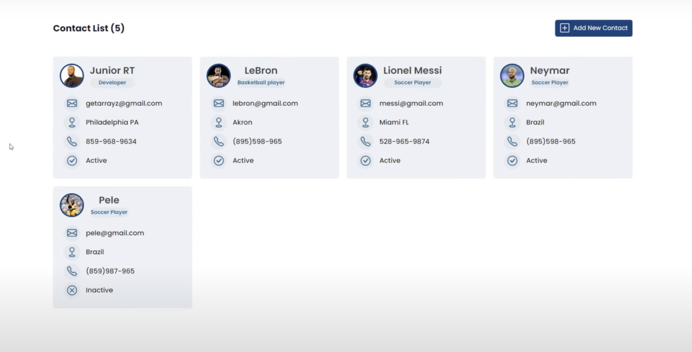
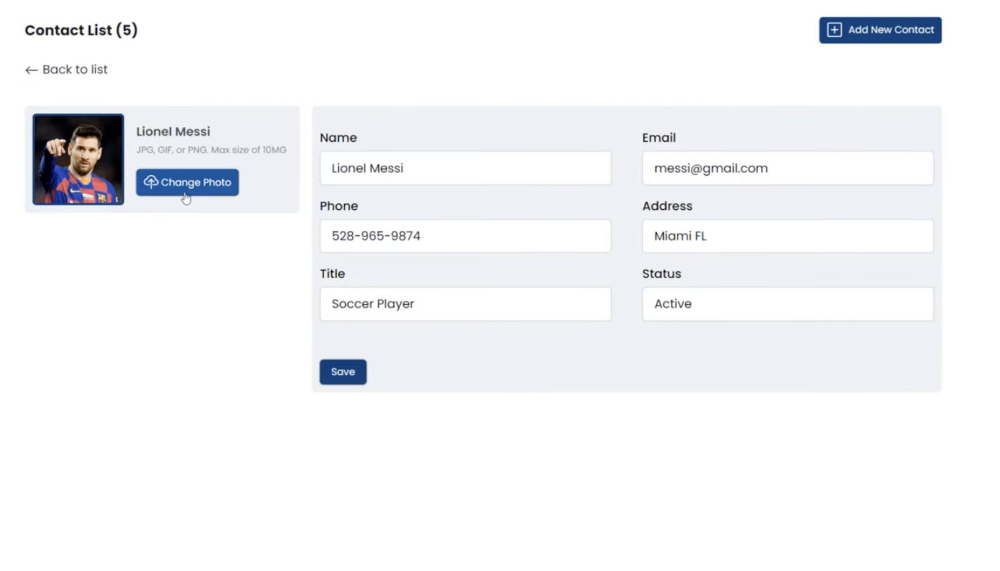
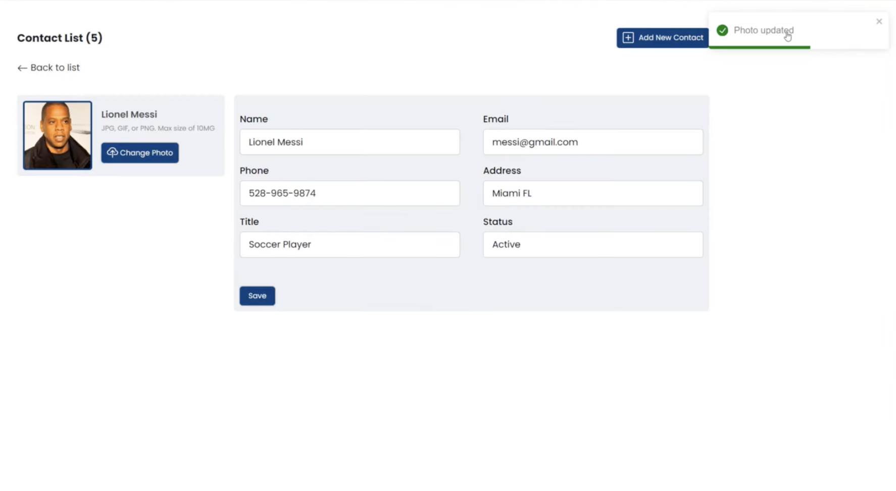
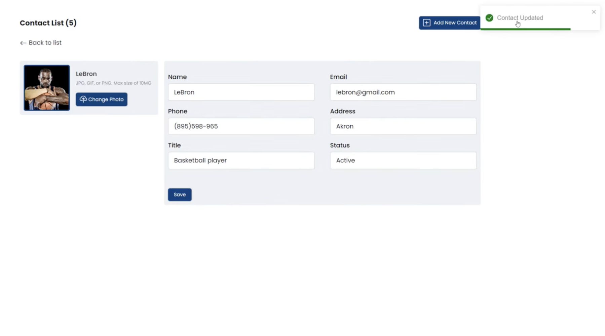

(Frontend of Contacts Manager App)

I built a webapp where users can manage their contacts :)

**Stack:** Spring Web, Spring Data JPA, PostgreSQL, React, JavaScript, BootStrap, Postman, and Toast

MVP Features:

- Add a new contact
- Add media for each contact
- Get contact
- Update contact info
- Delete contact by id
- Pagination
- Toast Notifications

## Screenshot

**Future Plans:**

- Work on UI...

- Implement OAuth Integration to seamlessly track contacts across devices and services

- Unit testing

- Dockerize
